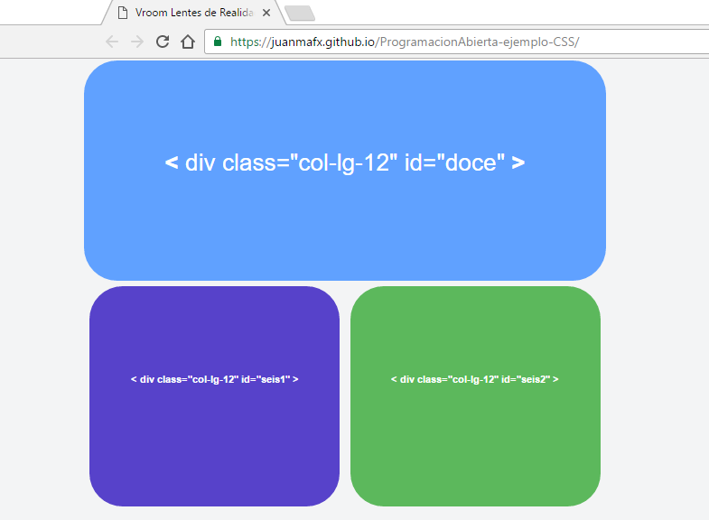

#¿Que es un DIV?

>ATENCIÓN  PUNTOS IMPORTANTES DEL FICHERO

En la linea de codigo 6 del archivo index.html:
Se llaman  al archivo css ejemplo.css que entregan los colores y el formatos para los 3 DIVs del ejemplo.

En la linea de codigo 7 del archivo index.html:
Se llama al archivo css que contiene a  Bootstrap que esta bajo el nombre css.css

En la linea de codigo 8 del archivo index.html:
Se llama al archivo css que contiene un css llamado temp.css que es una plantilla para manejar funciones ajenas al ejemplo. 

#Los divs puntualmente:

<b>&lt;</b>  div class="container"   <b>&gt;</b>

<b>&lt;</b>  div class="col-lg-12" id="doce"   <b>&gt;</b><b>&lt;</b>/div <b>&gt;</b>

<b>&lt;</b>  div class="col-lg-12" id="seis1"  <b>&gt;</b><b>&lt;</b>/div <b>&gt;</b>

<b>&lt;</b>  div class="col-lg-12" id="seis2"  <b>&gt;</b><b>&lt;</b>/div <b>&gt;</b>

<b>&lt;</b>/div <b>&gt;</b>

Ejemplo:
https://juanmafx.github.io/Que-es-un-div/

Fuente:
http://programacionabierta.com
